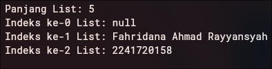

# PERTEMUAN 4

> Nama: Fahridana Ahmad Rayyansyah
>
> Kelas: TI-3B
>
> Absen: 10
<hr />

## Praktikum 1: Eksperimen Tipe Data List

### Langkah 1
Ketik atau salin kode program berikut ke dalam void main().
```Dart
void main() {
  var list = [1, 2, 3];
  assert(list.length == 3);
  assert(list[1] == 2);
  print(list.length);
  print(list[1]);

  list[1] = 1;
  assert(list[1] == 1);
  print(list[1]);
}
```

### Langkah 2:
Silakan coba eksekusi (Run) kode pada langkah 1 tersebut. Apa yang terjadi? Jelaskan!

**Jawab**
> Kode tersebut akan memiliki output seperti ini:
>
> 
>
> kode tersebut memiliki output seperti diatas karena perintah `print(list.length)`, `print(list[1])`, dan `print(list[1])`. `print(list.length)` memiliki output 3 karena panjang dari list adalah 3, `print(list[1])` memiliki output 2 karena elemen dari list indeks 1 adalah 2, sedangkan `print(list[1])` memiliki output 1 karena terjadi perubahan value pada indeks 1 sehingga jika diprint lagi akan menghasilkan 1


### Langkah 3:
Ubah kode pada langkah 1 menjadi variabel final yang mempunyai index = 5 dengan default value = null. Isilah nama dan NIM Anda pada elemen index ke-1 dan ke-2. Lalu print dan capture hasilnya.

Apa yang terjadi ? Jika terjadi error, silakan perbaiki.

**Jawab**
> ```Dart
> void main() {
>   final list = List<String?>.filled(5, null);
>   print("Panjang List: " + list.length.toString());
>   list[1] = "Fahridana Ahmad Rayyansyah";
>   list[2] = "2241720158";
>   print("Indeks ke-0 List: " + list[0].toString()); // null
>   print("Indeks ke-1 List: " + list[1].toString());
>   print("Indeks ke-2 List: " + list[2].toString());
> }
> ```
> Output:
> `
