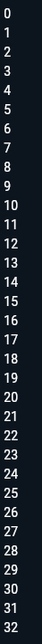
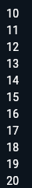

# PERTEMUAN 3

> Nama: Fahridana Ahmad Rayyansyah
>
> Kelas: TI-3B
> 
> Absen: 10
<hr />

## Praktikum 1: Menerapkan Control Flows ("if/else")

Selesaikan langkah-langkah praktikum berikut ini menggunakan DartPad di browser Anda.

### Langkah 1:
Ketik atau salin kode program berikut ke dalam fungsi `main()`
```Dart
void main() {
  String test = "test2";
  if(test == "test1") {
    print("Test1");
  }else if (test == "test2") {
    print("Test2");
  }else {
    print("Something else");
  }
  
  if(test == "test2") print("Test2 again");
}
```

### Langkah 2:
Silakan coba eksekusi (Run) kode pada langkah 1 tersebut. Apa yang terjadi? Jelaskan!

**Jawab**
> Kode tersebut akan memiliki output seperti ini:
> 
> 
>
> Pertama kode tersebut menginisialisasi sebuah variabel test yang berisi nilai string `"test2"` setelah itu dilakukan 2 kondisi if/else. Kondisi if/else pertama menghasilkan output `Test2`, dan kondisi if/else kedua menghasilkan output `Test2 again`. 


### Langkah 3:
Tambahkan kode program berikut, lalu coba eksekusi (Run) kode Anda.
```Dart
String test = "true";
if (test) {
   print("Kebenaran");
}
```
Apa yang terjadi ? Jika terjadi error, silakan perbaiki namun tetap menggunakan if/else.

**Jawab**
> Kode tersebut akan menghasilkan error, error 1 karena variabel test sudah ada, error kedua adalah variabel string yang digunakan untuk pengkodisian if/else yang mana harusnya menggunakan boolean. beginilah kode setelah diperbaiki:
> ```Dart
> bool isTrue = true;
> if (isTrue) {
>   print("Kebenaran");
> }
> ```


## Praktikum 2: Menerapkan Perulangan "while" dan "do-while"
Selesaikan langkah-langkah praktikum berikut ini menggunakan DartPad di browser Anda.
### Langkah 1:
Ketik atau salin kode program berikut ke dalam fungsi `main()`.
```Dart
void main() {
  while(counter < 33) {
    print(counter);
    counter++;
  }
}
```

### Langkah 2:
Silakan coba eksekusi (Run) kode pada langkah 1 tersebut. Apa yang terjadi? Jelaskan! Lalu perbaiki jika terjadi error.

**Jawab**
> Akan terjadi error karena variabel counter belum diinisialisasi, inilah kode setelah diperbaiki
> ```Dart
> void main() {
>   int counter = 0;
>   while(counter < 33) {
>     print(counter);
>     counter++;
>   }
> }
> ```
> dan akan memiliki output seperti ini
> 
> 

### Langkah 3:
Tambahkan kode program berikut, lalu coba eksekusi (Run) kode Anda.
```Dart
do {
    print(counter);
    counter++;
  } while (counter < 77);
```
Apa yang terjadi ? Jika terjadi error, silakan perbaiki namun tetap menggunakan do-while.

**Jawab**

> ```Dart
> void main() {
>   int counter = 0;
>   do {
>     print(counter);
>     counter++;
>   } while (counter < 77);
> }
> ```
> akan menghasilkan output dari 0 sampai 76 


## Praktikum 3: Menerapkan Perulangan "for" dan "break-continue"
Selesaikan langkah-langkah praktikum berikut ini menggunakan DartPad di browser Anda.

### Langkah 1:
Ketik atau salin kode program berikut ke dalam fungsi `main()`.
```Dart
for (Index = 10; index < 27; index) {
  print(Index);
}
```

### Langkah 2:
Silakan coba eksekusi (Run) kode pada langkah 1 tersebut. Apa yang terjadi? Jelaskan! Lalu perbaiki jika terjadi error.

**Jawab**

> Kode tersebut akan mengalami beberapa error karena variabel Index (seharusnya index), lalu terdapat error karena variabel index belum diinisialisasi, lalu terdapat error lagi karena kondisi index tidak berubah sehingga menyebabkan infinite loop. Inilah kode setelah diperbaiki:
> ```Dart
> for (int index = 10; index < 27; index++) {
>   print(index);
> }
> ```

### Langkah 3:
Tambahkan kode program berikut di dalam for-loop, lalu coba eksekusi (Run) kode Anda.
```Dart
If (Index == 21) break;
Else If (index > 1 || index < 7) continue;
print(index);
```
Apa yang terjadi ? Jika terjadi error, silakan perbaiki namun tetap menggunakan for dan break-continue.

**Jawab**
> Akan terjadi beberapa error, pertama huruf besar pada `If` dan `Else If`, kedua adalah kondisi pada `else if`, jika kondisinya adalah `(index > 1 || index < 7)` maka seluruh index akan dilakukan `continue` karena kondisi `index > 1` akan selalu bernilai true. inilah keseluruhan kodenya setelah diperbaiki.
> ```Dart
> for (int index = 10; index < 27; index++) {
>   if (index == 21) {
>     break;
>   } else if (index > 1 && index < 7) {
>     continue;
>   }
>   print(index);
> }
> ```
> Output:
> 
> 

## Tugas
1. Silakan selesaikan Praktikum 1 sampai 3, lalu dokumentasikan berupa screenshot hasil pekerjaan beserta penjelasannya! **Done bang**
2. Buatlah sebuah program yang dapat menampilkan bilangan prima dari angka 0 sampai 201 menggunakan Dart. Ketika bilangan prima ditemukan, maka tampilkan nama lengkap dan NIM Anda.

    **Jawab**

    ```Dart
      void main() {
        for(int i = 2; i <= 201; i++) {
        bool isPrime = true;
    
        for(int j = 2; j <= i ~/ 2; j++) {
          if(i % j == 0) isPrime = false;
        }
    
        if(isPrime) {
          print("Halo, nama saya Fahridana Ahmad Rayyansyah dengan NIM 2241720158");
        } 
      }
    }
    ```


3. Kumpulkan berupa link commit repo GitHub pada tautan yang telah disediakan di grup Telegram!