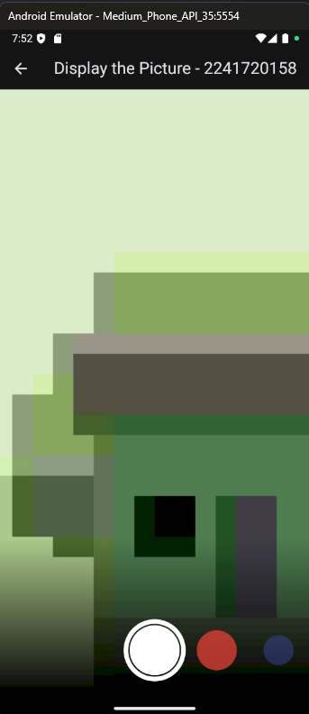
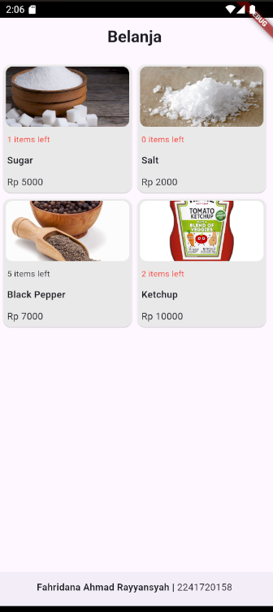

# PERTEMUAN 6

> Nama: Fahridana Ahmad Rayyansyah
>
> Kelas: TI-3B
>
> Absen: 10

<hr />

## Praktikum 1: Membangun Layout di Flutter

### Langkah 1: Buat Project Baru
Buatlah sebuah project flutter baru dengan nama layout_flutter. Atau sesuaikan style laporan praktikum yang Anda buat

### Langkah 2: Buka file lib/main.dart
Buka file `main.dart` lalu ganti dengan kode berikut. Isi nama dan NIM Anda di `text title`.

```Dart
import 'package:flutter/material.dart';

void main() => runApp(const MyApp());

class MyApp extends StatelessWidget {
  const MyApp({super.key});

  @override
  Widget build(BuildContext context) {
    return MaterialApp(
      title: 'Flutter layout: Nama dan NIM Anda',
      home: Scaffold(
        appBar: AppBar(
          title: const Text('Flutter layout demo'),
        ),
        body: const Center(
          child: Text('Hello World'),
        ),
      ),
    );
  }
}
```

### Langkah 3: Identifikasi layout diagram
Langkah pertama adalah memecah tata letak menjadi elemen dasarnya:
- Identifikasi baris dan kolom.
- Apakah tata letaknya menyertakan kisi-kisi (grid)?
- Apakah ada elemen yang tumpang tindih?
- Apakah UI memerlukan tab?
- Perhatikan area yang memerlukan alignment, padding, atau borders.

Pertama, identifikasi elemen yang lebih besar. Dalam contoh ini, empat elemen disusun menjadi sebuah kolom: sebuah gambar, dua baris, dan satu blok teks.

<div style="text-align: center;">
  
</div>

Selanjutnya, buat diagram setiap baris. Baris pertama, disebut bagian Judul, memiliki 3 anak: kolom teks, ikon bintang, dan angka. Anak pertamanya, kolom, berisi 2 baris teks. Kolom pertama itu memakan banyak ruang, sehingga harus dibungkus dengan widget yang Diperluas.

<div style="text-align: center;">
  
</div>

Baris kedua, disebut bagian Tombol, juga memiliki 3 anak: setiap anak merupakan kolom yang berisi ikon dan teks.

<div style="text-align: center;">
  
</div>

Setelah tata letak telah dibuat diagramnya, cara termudah adalah dengan menerapkan pendekatan bottom-up. Untuk meminimalkan kebingungan visual dari kode tata letak yang banyak bertumpuk, tempatkan beberapa implementasi dalam variabel dan fungsi.

### Langkah 4: Implementasi title row
Pertama, Anda akan membuat kolom bagian kiri pada judul. Tambahkan kode berikut di bagian atas metode `build()` di dalam kelas `MyApp`:
```Dart
 Widget build(BuildContext context) {
    Widget titleSection = Container(
      padding: const EdgeInsets.all(32),
      child: Row(
        children: [
          Expanded(
            /* soal 1*/
            child: Column(
              crossAxisAlignment: CrossAxisAlignment.start,
              children: [
                /* soal 2*/
                Container(
                  padding: const EdgeInsets.only(bottom: 8),
                  child: const Text(
                    'Batu, Malang, Indonesia',
                    style: TextStyle(
                      fontWeight: FontWeight.bold,
                    ),
                  ),
                ),
                const Text(
                  'Batu, Malang, Indonesia',
                  style: TextStyle(color: Colors.grey),
                ),
              ],
            ),
          ),
          /* soal 3*/
          const Icon(
            Icons.star,
            color: Colors.red,
          ),
          const Text("41"),
        ],
      ),
    );

    return MaterialApp(
      title: 'Flutter Layout: Fahridana Ahmad Rayyansyah - 2241720158',
      home: Scaffold(
        appBar: AppBar(
          title: const Text('Flutter layout demo'),
        ),
        body: Column(
          children: [
            titleSection,
          ],
        ),
      ),
    );
  }
```


## Praktikum 2: Implementasi button row
Selesaikan langkah-langkah praktikum berikut ini dengan melanjutkan dari praktikum sebelumnya.

### Langkah 1: Buat method Column _buildButtonColumn
Bagian tombol berisi 3 kolom yang menggunakan tata letak yang sama—sebuah ikon di atas baris teks. Kolom pada baris ini diberi jarak yang sama, dan teks serta ikon diberi warna primer.

Karena kode untuk membangun setiap kolom hampir sama, buatlah metode pembantu pribadi bernama `buildButtonColumn()`, yang mempunyai parameter warna, `Icon` dan `Text`, sehingga dapat mengembalikan kolom dengan widgetnya sesuai dengan warna tertentu.

```Dart
Column _buildButtonColumn(Color color, IconData icon, String label) {
    return Column(
      mainAxisSize: MainAxisSize.min,
      mainAxisAlignment: MainAxisAlignment.center,
      children: [
        Icon(icon, color: color),
        Container(
          margin: const EdgeInsets.only(top: 8),
          child: Text(
            label,
            style: TextStyle(
              fontSize: 12,
              fontWeight: FontWeight.w400,
              color: color,
            ),
          ),
        ),
      ],
    );
  }
```

### Langkah 2: Buat widget buttonSection
Buat Fungsi untuk menambahkan ikon langsung ke kolom. Teks berada di dalam `Container` dengan margin hanya di bagian atas, yang memisahkan teks dari ikon.

Bangun baris yang berisi kolom-kolom ini dengan memanggil fungsi dan set warna, `Icon`, dan teks khusus melalui parameter ke kolom tersebut. Sejajarkan kolom di sepanjang sumbu utama menggunakan `MainAxisAlignment.spaceEvenly` untuk mengatur ruang kosong secara merata sebelum, di antara, dan setelah setiap kolom. Tambahkan kode berikut tepat di bawah deklarasi `titleSection` di dalam metode `build()`:
```Dart
Color color = Theme.of(context).primaryColor;

Widget buttonSection = Row(
  mainAxisAlignment: MainAxisAlignment.spaceEvenly,
  children: [
    _buildButtonColumn(color, Icons.call, 'CALL'),
    _buildButtonColumn(color, Icons.near_me, 'ROUTE'),
    _buildButtonColumn(color, Icons.share, 'SHARE'),
  ],
);
```

### Langkah 3: Tambah button section ke body
Tambahkan variabel `buttonSection` ke dalam `body` seperti berikut
```Dart
return MaterialApp(
      title: 'Flutter Layout: Fahridana Ahmad Rayyansyah - 2241720158',
      home: Scaffold(
        appBar: AppBar(
          title: const Text('Flutter layout demo'),
        ),
        body: Column(
          children: [
            titleSection,
            buttonSection,
          ],
        ),
      ),
    );
```

## Praktikum 3: Implementasi text section
Selesaikan langkah-langkah praktikum berikut ini dengan melanjutkan dari praktikum sebelumnya.

### Langkah 1: Buat widget textSection
Tentukan bagian teks sebagai variabel. Masukkan teks ke dalam `Container` dan tambahkan padding di sepanjang setiap tepinya. Tambahkan kode berikut tepat di bawah deklarasi `buttonSection`:
```Dart
Widget textSection = Container(
      padding: const EdgeInsets.all(32),
      child: const Text(
        'Kota Batu, also known as Batu, is a city in Indonesia`s East Java Province. A former Dutch hill retreat, it`s
        surrounded by mountains like Arjuno and Welirang, which have summit trails. Jawa Timur Park 2 has exotic
        animals at Batu Secret Zoo, and animal skeletons at Museum Satwa. To the west, Songgokerto village is home to
        hot springs and the ancient Hindu Songgoriti Temple. Nearby is the high Coban Rondo Waterfall.',
        softWrap: true,
      ),
    );
```
Dengan memberi nilai `softWrap` = true, baris teks akan memenuhi lebar kolom sebelum membungkusnya pada batas kata.

### Langkah 2: Tambahkan variabel text section ke body

Tambahkan widget variabel textSection ke dalam body seperti berikut:
```Dart
return MaterialApp(
      title: 'Flutter Layout: Fahridana Ahmad Rayyansyah - 2241720158',
      home: Scaffold(
        appBar: AppBar(
          title: const Text('Flutter layout demo'),
        ),
        body: Column(
          children: [
            titleSection,
            buttonSection,
            textSection,
          ],
        ),
      ),
    );
```

## Praktikum 4: Implementasi image section

Selesaikan langkah-langkah praktikum berikut ini dengan melanjutkan dari praktikum sebelumnya.

### Langkah 1: Siapkan aset gambar
Anda dapat mencari gambar di internet yang ingin ditampilkan. Buatlah folder `images` di root project **layout_flutter**. Masukkan file gambar tersebut ke folder `images`, lalu set nama file tersebut ke file `pubspec.yaml` seperti berikut:
```yaml
assets:
        - assets/images/
```

### Langkah 2: Tambahkan gambar ke body
Tambahkan aset gambar ke dalam body seperti berikut:
```Dart
return MaterialApp(
      title: 'Flutter Layout: Fahridana Ahmad Rayyansyah - 2241720158',
      home: Scaffold(
        appBar: AppBar(
          title: const Text('Flutter layout demo'),
        ),
        body: Column(
          children: [
            Image.asset(
              'assets/images/image.png',
              width: 600,
              height: 240,
              fit: BoxFit.cover,
            ),
            titleSection,
            buttonSection,
            textSection,
          ],
        ),
      ),
    );
```
`BoxFit.cover` memberi tahu kerangka kerja bahwa gambar harus sekecil mungkin tetapi menutupi seluruh kotak rendernya.

### Langkah 3: Terakhir, ubah menjadi ListView
Pada langkah terakhir ini, atur semua elemen dalam `ListView`, bukan Column, karena `ListView` mendukung scroll yang dinamis saat aplikasi dijalankan pada perangkat yang resolusinya lebih kecil.
```Dart
return MaterialApp(
      title: 'Flutter Layout: Fahridana Ahmad Rayyansyah - 2241720158',
      home: Scaffold(
        appBar: AppBar(
          title: const Text('Flutter layout demo'),
        ),
        body: ListView(
          children: [
            Image.asset(
              'assets/images/image.png',
              width: 600,
              height: 240,
              fit: BoxFit.cover,
            ),
            titleSection,
            buttonSection,
            textSection,
          ],
        ),
      ),
    );
```

Output hasil praktikum 1-4



## Tugas 1 Praktikum


## Praktikum 5: Membangun Navigasi di Flutter
Pada praktikum 5 ini anda akan belajar mengenai pembangunan aplikasi bergerak multi halaman. Aplikasi yang dikembangkan berupa kasus daftar barang belanja. Pada aplikasi ini anda akan belajar untuk berpindah halaman dan mengirimkan data ke halaman lainnya. Gambaran mockup hasil akhir aplikasi dapat anda lihat pada gambar di atas (mockup dibuat sederhana, sehingga Anda mempunyai banyak ruang untuk berkreasi). Desain aplikasi menampilkan sebuah ListView widget yang datanya bersumber dari List. Ketika item ditekan, data akan dikirimkan ke halaman berikutnya.

### Langkah 1: Siapkan project baru
Sebelum melanjutkan praktikum, buatlah sebuah project baru Flutter dengan nama belanja dan susunan folder seperti pada gambar berikut. Penyusunan ini dimaksudkan untuk mengorganisasi kode dan widget yang lebih mudah.


### Langkah 2: Mendefinisikan Route

Buatlah dua buah file dart dengan nama `home_page.dart` dan `item_page.dart` pada folder **pages**. Untuk masing-masing file, deklarasikan `class HomePage` pada file `home_page.dart` dan ItemPage pada `item_page.dart`. Turunkan class dari `StatelessWidget`. Gambaran potongan kode dapat anda lihat sebagai berikut.

```Dart
Class HomePage extends StatelessWidget {
  @override
  Widget build(BuildContext context) {
    throw UnimplementedError();
  }
}
```

```Dart
Class ItemPage extends StatelessWidget {
  @override
  Widget build(BuildContext context) {
    throw UnimplementedError();
  }
}
```

### Langkah 3: Lengkapi Kode di main.dart
Setelah kedua halaman telah dibuat dan didefinisikan, bukalah file `main.dart`. Pada langkah ini anda akan mendefinisikan **Route** untuk kedua halaman tersebut. Definisi penamaan **route** harus bersifat **unique**. Halaman **HomePage** didefinisikan sebagai /. Dan halaman **ItemPage** didefinisikan sebagai /item. Untuk mendefinisikan halaman awal, anda dapat menggunakan `named argument initialRoute`. Gambaran tahapan ini, dapat anda lihat pada potongan kode berikut.

```Dart
void main() {
  runApp(MaterialApp(
    initialRoute: '/',
    routes: {
      '/': (context) => HomePage(),
      '/item': (context) => ItemPage(),
    },
  ));
}
```

### Langkah 4: Membuat data model
Sebelum melakukan perpindahan halaman dari `HomePage` ke `ItemPage`, dibutuhkan proses pemodelan data. Pada desain mockup, dibutuhkan dua informasi yaitu nama dan harga. Untuk menangani hal ini, buatlah sebuah file dengan nama `item.dart` dan letakkan pada folder **models**. Pada file ini didefinisikan pemodelan data yang dibutuhkan. Ilustrasi kode yang dibutuhkan, dapat anda lihat pada potongan kode berikut.

```Dart
class Item {
  String name;
  int price;

  Item({
    required this.name,
    required this.price,
  });
}

```

### Langkah 5: Lengkapi kode di class HomePage
Pada halaman `HomePage` terdapat `ListView` widget. Sumber data ListView diambil dari model List dari object Item. Gambaran kode yang dibutuhkan untuk melakukan definisi model dapat anda lihat sebagai berikut.

```Dart
Class HomePage extends StatelessWidget {
  final List<view> items = [
    Item(name: 'Sugar', price: 5000),
    Item(name: 'Salt', price 2000)
  ]
}
```

### Langkah 6: Membuat ListView dan itemBuilder
Untuk menampilkan `ListView` pada praktikum ini digunakan `itemBuilder`. Data diambil dari definisi model yang telah dibuat sebelumnya. Untuk menunjukkan batas data satu dan berikutnya digunakan widget `Card`. Kode yang telah umum pada bagian ini tidak ditampilkan. Gambaran kode yang dibutuhkan dapat anda lihat sebagai berikut.

```Dart
body: Container(
    margin: EdgeInsets. all(8),
    child: ListView. builder(
      padding: EdgeInsets. all(8),
      itemCount: items.length,
      itemBuilder: (context, index) {
        final item = items[index];
        return Card(
          child: Container(
            margin: EdgeInsets. all(8),
            child: Row(
              children: [
                Expanded(child: Text(item.name)),
                Expanded(
                  child: Text(
                    item.price.toString(),
                    textAlign: TextAlign.end,
                  ),
                )
              ],
            )
          )
        )
      }
    )
)
```

### Langkah 7: Menambahkan aksi pada ListView
Item pada ListView saat ini ketika ditekan masih belum memberikan aksi tertentu. Untuk menambahkan aksi pada ListView dapat digunakan widget InkWell atau GestureDetector. Perbedaan utamanya InkWell merupakan material widget yang memberikan efek ketika ditekan. Sedangkan GestureDetector bersifat umum dan bisa juga digunakan untuk gesture lain selain sentuhan. Pada praktikum ini akan digunakan widget InkWell.

Untuk menambahkan sentuhan, letakkan cursor pada widget pembuka Card. Kemudian gunakan shortcut quick fix dari VSCode (Ctrl + . pada Windows atau Cmd + . pada MacOS). Sorot menu wrap with widget... Ubah nilai widget menjadi InkWell serta tambahkan named argument onTap yang berisi fungsi untuk berpindah ke halaman ItemPage. Ilustrasi potongan kode dapat anda lihat pada potongan berikut.

```Dart
return InkWell(
  onTap: () {
    Navigator.pushNamed(context:, '/item');
  },
)
```

### Tugas Praktikum 2
1. Untuk melakukan pengiriman data ke halaman berikutnya, cukup menambahkan informasi arguments pada penggunaan Navigator. Perbarui kode pada bagian Navigator menjadi seperti berikut.
    ```Dart
    Navigator.pushNamed(context, '/item', arguments: item);
    ```
2. Pembacaan nilai yang dikirimkan pada halaman sebelumnya dapat dilakukan menggunakan ModalRoute. Tambahkan kode berikut pada blok fungsi build dalam halaman ItemPage. Setelah nilai didapatkan, anda dapat menggunakannya seperti penggunaan variabel pada umumnya. (https://docs.flutter.dev/cookbook/navigation/navigate-with-arguments)
   ```Dart
   final itemArgs = ModalRoute.of(context)!.settings.arguments as Item;
   ```
3. Pada hasil akhir dari aplikasi belanja yang telah anda selesaikan, tambahkan atribut foto produk, stok, dan rating. Ubahlah tampilan menjadi GridView seperti di aplikasi marketplace pada umumnya.
4. Silakan implementasikan Hero widget pada aplikasi belanja Anda dengan mempelajari dari sumber ini: https://docs.flutter.dev/cookbook/navigation/hero-animations
5. Sesuaikan dan modifikasi tampilan sehingga menjadi aplikasi yang menarik. Selain itu, pecah widget menjadi kode yang lebih kecil. Tambahkan Nama dan NIM di footer aplikasi belanja Anda.

   **Hasil Tugas no 3-5**

   
6. Selesaikan Praktikum 5: Navigasi dan Rute tersebut. Cobalah modifikasi menggunakan plugin go_router, lalu dokumentasikan dan push ke repository Anda berupa screenshot setiap hasil pekerjaan beserta penjelasannya di file README.md. Kumpulkan link commit repository GitHub Anda kepada dosen yang telah disepakati!
   ```Dart
    import 'package:belanja/models/item.dart';
    import 'package:belanja/pages/home_page.dart';
    import 'package:belanja/pages/item_page.dart';
    import 'package:flutter/material.dart';
    import 'package:go_router/go_router.dart';

    void main() {
      runApp(
        MaterialApp.router(
          routerConfig: GoRouter(
            routes: [
              GoRoute(
                path: '/',
                builder: (context, state) {
                  return const HomePage();
                },
              ),
              GoRoute(
                path: '/item',
                builder: (context, state) {
                  final item = state.extra as Item;
                  return ItemPage(itemArgs: item);
                },
              ),
            ],
          ),
        ),
      );
    }
   ```
