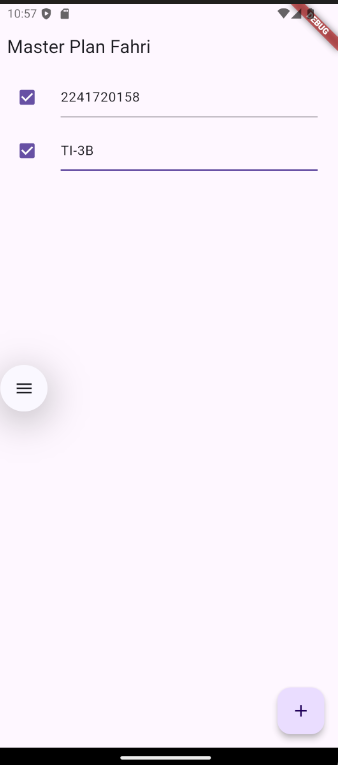
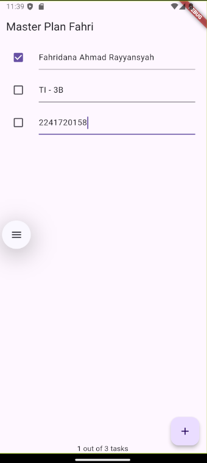
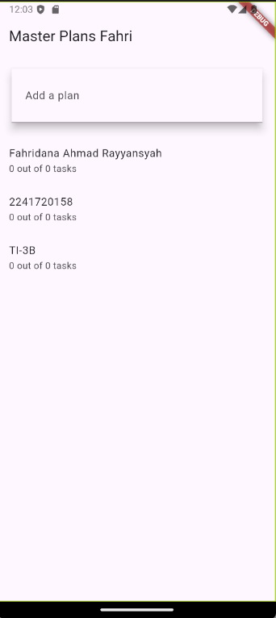
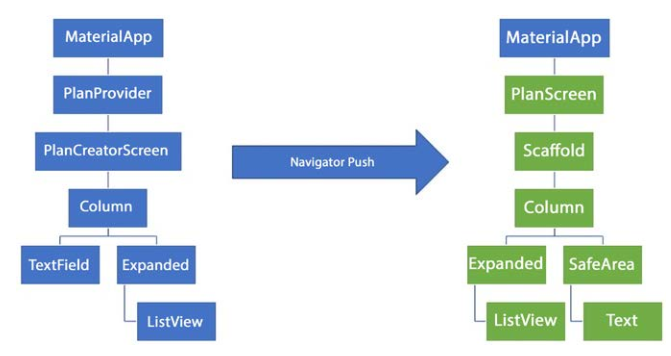

# PERTEMUAN 10 - Dasar State Management

> Nama: Fahridana Ahmad Rayyansyah
>
> Kelas: TI-3B
>
> Absen: 10

<hr />

## Praktikum 1: Dasar State dengan Model-View

### Langkah 1: Buat Project Baru
Buatlah sebuah project flutter baru dengan nama **master_plan**

### Langkah 2: Membuat model task.dart

**lib/models/task.dart**
```Dart
class Task {
  final String description;
  final bool complete;

  const Task({
    this.complete = false,
    this.description = '',
  });
}
```

### Langkah 3: Buat file plan.dart

**lib/models/plan.dart**
```Dart
import './task.dart';

class Plan {
  final String name;
  final List<Task> tasks;

  const Plan({this.name = '', this.tasks = const []});
}
```

### Langkah 4: Buat file data_layer.dart

**lib/models/data_layer.dart**
```Dart
export 'plan.dart';
export 'task.dart';
```

### Langkah 5: Pindah ke file main.dart

**lib/main.dart**
```Dart
import 'package:flutter/material.dart';
import './views/plan_screen.dart';

void main() => runApp(MasterPlanApp());

class MasterPlanApp extends StatelessWidget {
  const MasterPlanApp({super.key});

  @override
  Widget build(BuildContext context) {
    return MaterialApp(
     theme: ThemeData(primarySwatch: Colors.purple),
     home: PlanScreen(),
    );
  }
}
```

### Langkah 6: buat plan_screen.dart

**lib/plan_screen.dart**
```Dart
import '../models/data_layer.dart';
import 'package:flutter/material.dart';

class PlanScreen extends StatefulWidget {
  const PlanScreen({super.key});

  @override
  State createState() => _PlanScreenState();
}

class _PlanScreenState extends State<PlanScreen> {
  Plan plan = const Plan();

  @override
  Widget build(BuildContext context) {
   return Scaffold(
    appBar: AppBar(title: const Text('Master Plan Fahri')),
    body: _buildList(),
    floatingActionButton: _buildAddTaskButton(),
   );
  }
}
```

### Langkah 7: buat method _buildAddTaskButton()

```Dart
Widget _buildAddTaskButton() {
  return FloatingActionButton(
   child: const Icon(Icons.add),
   onPressed: () {
     setState(() {
      plan = Plan(
       name: plan.name,
       tasks: List<Task>.from(plan.tasks)
       ..add(const Task()),
     );
    });
   },
  );
}
```

### Langkah 8: buat widget _buildList()

```Dart
Widget _buildList() {
  return ListView.builder(
   itemCount: plan.tasks.length,
   itemBuilder: (context, index) =>
   _buildTaskTile(plan.tasks[index], index),
  );
}
```

### Langkah 9: buat widget _buildTaskTile

```Dart
 Widget _buildTaskTile(Task task, int index) {
    return ListTile(
      leading: Checkbox(
          value: task.complete,
          onChanged: (selected) {
            setState(() {
              plan = Plan(
                name: plan.name,
                tasks: List<Task>.from(plan.tasks)
                  ..[index] = Task(
                    description: task.description,
                    complete: selected ?? false,
                  ),
              );
            });
          }),
      title: TextFormField(
        initialValue: task.description,
        onChanged: (text) {
          setState(() {
            plan = Plan(
              name: plan.name,
              tasks: List<Task>.from(plan.tasks)
                ..[index] = Task(
                  description: text,
                  complete: task.complete,
                ),
            );
          });
        },
      ),
    );
  }
```

### Langkah 10: Tambah Scroll Controller

```Dart
late ScrollController scrollController;
```

### Langkah 11: Tambah Scroll Listener

```Dart
@override
void initState() {
  super.initState();
  scrollController = ScrollController()
    ..addListener(() {
      FocusScope.of(context).requestFocus(FocusNode());
    });
}
```

### Langkah 12: Tambah controller dan keyboard behavior

```Dart
return ListView.builder(
  controller: scrollController,
 keyboardDismissBehavior: Theme.of(context).platform ==
 TargetPlatform.iOS
          ? ScrollViewKeyboardDismissBehavior.onDrag
          : ScrollViewKeyboardDismissBehavior.manual,
```

### Langkah 13: Terakhir, tambah method dispose()

```Dart
@override
void dispose() {
  scrollController.dispose();
  super.dispose();
}
```

### Langkah 14: Hasil

Lakukan Hot restart (bukan hot reload) pada aplikasi Flutter Anda. Anda akan melihat tampilan akhir seperti gambar berikut. Jika masih terdapat error, silakan diperbaiki hingga bisa running.




## Tugas Praktikum 1: Dasar State dengan Model-View
1. Selesaikan langkah-langkah praktikum tersebut, lalu dokumentasikan berupa GIF hasil akhir praktikum beserta penjelasannya di file README.md! Jika Anda menemukan ada yang error atau tidak berjalan dengan baik, silakan diperbaiki.
2. Jelaskan maksud dari langkah 4 pada praktikum tersebut! Mengapa dilakukan demikian?

   **Jawab**
   > Langkah ini dilakukan untuk mengelompokkan dan mengatur model data dalam satu file agar dapat diimpor dengan mudah di berbagai bagian aplikasi.

3. Mengapa perlu variabel plan di langkah 6 pada praktikum tersebut? Mengapa dibuat konstanta ?

    **Jawab**
    > Variabel plan Digunakan untuk menyimpan data rencana (plan) yang terdiri dari nama dan daftar tugas (tasks).
    >
    > Variabel plan dibuat sebagai konstanta untuk memastikan bahwa objek Plan yang diinisialisasi tidak dapat diubah setelah dibuat.

4. Lakukan capture hasil dari Langkah 9 berupa GIF, kemudian jelaskan apa yang telah Anda buat!

    **Jawab**
    

    > Widget ini memungkinkan pengguna untuk melihat dan mengedit deskripsi tugas serta menandai tugas sebagai selesai atau belum selesai. Setiap perubahan pada Checkbox atau TextFormField akan memperbarui objek Plan dengan tugas yang diperbarui.

5. Apa kegunaan method pada Langkah 11 dan 13 dalam lifecyle state ?

    **Jawab**
    > * **Langkah 11** : `initState` digunakan untuk menginisialisasi `ScrollController` dan menambahkan listener yang akan menghilangkan fokus dari elemen input saat pengguna melakukan scroll.
    >
    > * **Langkah 13** : `dispose` digunakan untuk membersihkan ScrollController saat widget dihapus dari pohon widget. Ini penting untuk mencegah kebocoran memori dengan memastikan bahwa semua listener dan controller dibersihkan dengan benar.

6. Kumpulkan laporan praktikum Anda berupa link commit atau repository GitHub ke dosen yang telah disepakati !


## Praktikum 2: Mengelola Data Layer dengan InheritedWidget dan InheritedNotifier

### Langkah 1: Buat file plan_provider.dart

**lib/provider/plan_provider.dart**
```Dart
import 'package:flutter/material.dart';
import '../models/data_layer.dart';

class PlanProvider extends InheritedNotifier<ValueNotifier<Plan>> {
  const PlanProvider({super.key, required Widget child, required
   ValueNotifier<Plan> notifier})
  : super(child: child, notifier: notifier);

  static ValueNotifier<Plan> of(BuildContext context) {
   return context.
    dependOnInheritedWidgetOfExactType<PlanProvider>()!.notifier!;
  }
}
```

### Langkah 2: Edit main.dart

**lib/main.dart**
```Dart
return MaterialApp(
  theme: ThemeData(primarySwatch: Colors.purple),
  home: PlanProvider(
    notifier: ValueNotifier<Plan>(const Plan()),
    child: const PlanScreen(),
   ),
);
```

### Langkah 3: Tambah method pada model plan.dart

**lib/models/plan.dart**

```Dart
class Plan {
  final String name;
  final List<Task> tasks;
  int get completedCount => tasks.where((task) => task.complete).length;
  String get completenessMessage =>
      '$completedCount out of ${tasks.length} tasks';
  const Plan({this.name = '', this.tasks = const []});
}
```

### Langkah 4: Pindah ke PlanScreen

Edit `PlanScreen` agar menggunakan data dari `PlanProvider`. Hapus deklarasi variabel `plan` (ini akan membuat error). Kita akan perbaiki pada langkah 5 berikut ini.

### Langkah 5: Edit method _buildAddTaskButton
Tambahkan `BuildContext` sebagai parameter dan gunakan `PlanProvider` sebagai sumber datanya. Edit bagian kode seperti berikut.

```Dart
Widget _buildAddTaskButton(BuildContext context) {
  ValueNotifier<Plan> planNotifier = PlanProvider.of(context);
  return FloatingActionButton(
    child: const Icon(Icons.add),
    onPressed: () {
      Plan currentPlan = planNotifier.value;
      planNotifier.value = Plan(
        name: currentPlan.name,
        tasks: List<Task>.from(currentPlan.tasks)..add(const Task()),
      );
    },
  );
}
```

### Langkah 6: Edit method _buildTaskTile

```Dart
Widget _buildTaskTile(Task task, int index, BuildContext context) {
  ValueNotifier<Plan> planNotifier = PlanProvider.of(context);
  return ListTile(
    leading: Checkbox(
       value: task.complete,
       onChanged: (selected) {
         Plan currentPlan = planNotifier.value;
         planNotifier.value = Plan(
           name: currentPlan.name,
           tasks: List<Task>.from(currentPlan.tasks)
             ..[index] = Task(
               description: task.description,
               complete: selected ?? false,
             ),
         );
       }),
    title: TextFormField(
      initialValue: task.description,
      onChanged: (text) {
        Plan currentPlan = planNotifier.value;
        planNotifier.value = Plan(
          name: currentPlan.name,
          tasks: List<Task>.from(currentPlan.tasks)
            ..[index] = Task(
              description: text,
              complete: task.complete,
            ),
        );
      },
    ),
  );
}
```

### Langkah 7: Edit _buildList

```Dart
Widget _buildList(Plan plan) {
   return ListView.builder(
     controller: scrollController,
     itemCount: plan.tasks.length,
     itemBuilder: (context, index) =>
        _buildTaskTile(plan.tasks[index], index, context),
   );
}
```

### Langkah 8: Tetap di class PlanScreen
Edit method build sehingga bisa tampil progress pada bagian bawah (footer). Caranya, bungkus (wrap) _buildList dengan widget Expanded dan masukkan ke dalam widget Column seperti kode pada Langkah 9.

### Langkah 9: Tambah widget SafeArea

```Dart
@override
Widget build(BuildContext context) {
   return Scaffold(
     appBar: AppBar(title: const Text('Master Plan')),
     body: ValueListenableBuilder<Plan>(
       valueListenable: PlanProvider.of(context),
       builder: (context, plan, child) {
         return Column(
           children: [
             Expanded(child: _buildList(plan)),
             SafeArea(child: Text(plan.completenessMessage))
           ],
         );
       },
     ),
     floatingActionButton: _buildAddTaskButton(context),
   );
}
```

### Hasil


## Tugas Praktikum 2: InheritedWidget

1. Selesaikan langkah-langkah praktikum tersebut, lalu dokumentasikan berupa GIF hasil akhir praktikum beserta penjelasannya di file README.md! Jika Anda menemukan ada yang error atau tidak berjalan dengan baik, silakan diperbaiki sesuai dengan tujuan aplikasi tersebut dibuat.
2. Jelaskan mana yang dimaksud InheritedWidget pada langkah 1 tersebut! Mengapa yang digunakan InheritedNotifier?

    **Jawab**
    > `PlanProvider` adalah subclass dari `InheritedNotifier`, yang pada dasarnya adalah `InheritedWidget` yang menggabungkan fungsionalitas `InheritedWidget` dengan `ValueNotifier`.
    >
    > `InheritedNotifier` digunakan karena memungkinkan widget untuk mendengarkan perubahan pada `ValueNotifier` dan secara otomatis membangun ulang bagian-bagian dari pohon widget yang bergantung pada data tersebut. Ini sangat berguna untuk state management karena memungkinkan pembaruan UI yang efisien ketika data berubah.

3. Jelaskan maksud dari method di langkah 3 pada praktikum tersebut! Mengapa dilakukan demikian?

    **Jawab**
    > Method `completedCount` menghitung jumlah tugas yang telah selesai, sedangkan `completenessMessage` memberikan pesan yang menunjukkan berapa banyak tugas yang telah selesai dari total tugas. Ini dilakukan untuk menyediakan informasi yang berguna tentang status penyelesaian tugas kepada pengguna, yang kemudian dapat ditampilkan di UI.
4. Lakukan capture hasil dari Langkah 9 berupa GIF, kemudian jelaskan apa yang telah Anda buat!

   

   **Jawab**
   > Membuat UI yang menampilkan daftar tugas dalam ListView yang dapat discroll, dan menambahkan pesan status penyelesaian tugas di bagian bawah layar. Expanded digunakan untuk memastikan bahwa ListView mengambil semua ruang yang tersedia di antara AppBar dan SafeArea. SafeArea digunakan untuk memastikan bahwa pesan status tidak tertutup oleh elemen UI lain seperti notch atau home indicator pada perangkat.

6. Kumpulkan laporan praktikum Anda berupa link commit atau repository GitHub ke dosen yang telah disepakati !

## Praktikum 3: Membuat State di Multiple Screens

### Langkah 1: Edit PlanProvider

**lib/provider/plan_provider.dart**
```Dart
class PlanProvider extends
InheritedNotifier<ValueNotifier<List<Plan>>> {
  const PlanProvider({super.key, required Widget child, required
ValueNotifier<List<Plan>> notifier})
     : super(child: child, notifier: notifier);

  static ValueNotifier<List<Plan>> of(BuildContext context) {
    return context.
dependOnInheritedWidgetOfExactType<PlanProvider>()!.notifier!;
  }
}
```

### Langkah 2: Edit main.dart

```Dart
@override
Widget build(BuildContext context) {
  return PlanProvider(
    notifier: ValueNotifier<List<Plan>>(const []),
    child: MaterialApp(
      title: 'State management app',
      theme: ThemeData(
        primarySwatch: Colors.blue,
      ),
      home: const PlanScreen(),
    ),
  );
}
```

### Langkah 3: Edit plan_screen.dart
```Dart
final Plan plan;
const PlanScreen({super.key, required this.plan});
```

### Langkah 4: Error
Itu akan terjadi error setiap kali memanggil `PlanProvider.of(context)`. Itu terjadi karena screen saat ini hanya menerima tugas-tugas untuk satu kelompok `Plan`, tapi sekarang `PlanProvider` menjadi list dari objek plan tersebut

### Langkah 5: Tambah getter Plan

```Dart
class _PlanScreenState extends State<PlanScreen> {
  late ScrollController scrollController;
  Plan get plan => widget.plan;
```

### Langkah 6: Method initState()
```Dart
@override
void initState() {
   super.initState();
   scrollController = ScrollController()
    ..addListener(() {
      FocusScope.of(context).requestFocus(FocusNode());
    });
}
```

### Langkah 7: Widget build

```Dart
  @override
  Widget build(BuildContext context) {
    ValueNotifier<List<Plan>> plansNotifier = PlanProvider.of(context);

    return Scaffold(
      appBar: AppBar(title: Text(_plan.name)),
      body: ValueListenableBuilder<List<Plan>>(
        valueListenable: plansNotifier,
        builder: (context, plans, child) {
          Plan currentPlan = plans.firstWhere((p) => p.name == plan.
name);
          return Column(
            children: [
              Expanded(child: _buildList(currentPlan)),
              SafeArea(child: Text(currentPlan.
completenessMessage)),
            ],);},),
      floatingActionButton: _buildAddTaskButton(context,)
  ,);
 }

  Widget _buildAddTaskButton(BuildContext context) {
    ValueNotifier<List<Plan>> planNotifier = PlanProvider.
of(context);
    return FloatingActionButton(
      child: const Icon(Icons.add),
      onPressed: () {
        Plan currentPlan = plan;
        int planIndex =
            planNotifier.value.indexWhere((p) => p.name == currentPlan.name);
        List<Task> updatedTasks = List<Task>.from(currentPlan.tasks)
          ..add(const Task());
        planNotifier.value = List<Plan>.from(planNotifier.value)
          ..[planIndex] = Plan(
            name: currentPlan.name,
            tasks: updatedTasks,
          );
        plan = Plan(
          name: currentPlan.name,
          tasks: updatedTasks,
        );},);
  }
```

### Langkah 8: Edit _buildTaskTile

```Dart
  Widget _buildTaskTile(Task task, int index, BuildContext context)
{
    ValueNotifier<List<Plan>> planNotifier = PlanProvider.
of(context);

    return ListTile(
      leading: Checkbox(
         value: task.complete,
         onChanged: (selected) {
           Plan currentPlan = plan;
           int planIndex = planNotifier.value
              .indexWhere((p) => p.name == currentPlan.name);
           planNotifier.value = List<Plan>.from(planNotifier.value)
             ..[planIndex] = Plan(
               name: currentPlan.name,
               tasks: List<Task>.from(currentPlan.tasks)
                 ..[index] = Task(
                   description: task.description,
                   complete: selected ?? false,
                 ),);
         }),
      title: TextFormField(
        initialValue: task.description,
        onChanged: (text) {
          Plan currentPlan = plan;
          int planIndex =
             planNotifier.value.indexWhere((p) => p.name ==
currentPlan.name);
          planNotifier.value = List<Plan>.from(planNotifier.value)
            ..[planIndex] = Plan(
              name: currentPlan.name,
              tasks: List<Task>.from(currentPlan.tasks)
                ..[index] = Task(
                  description: text,
                  complete: task.complete,
                ),
            );
},),);}
```

### Langkah 9: Buat screen baru
Pada folder `view`, Membuat file baru dengan nama `plan_creator_screen.dart`

**lib/view/plan_creator_screen.dart**
```Dart
class PlanCreatorScreen extends StatefulWidget {
  const PlanCreatorScreen({super.key});

  @override
  State createState() => _PlanCreatorScreenState();
}
```

**lib/main.dart**
```Dart
import 'package:flutter/material.dart';
import 'package:master_plan/models/plan.dart';
import 'package:master_plan/provider/plan_provider.dart';
import 'package:master_plan/views/plan_creator_screen.dart';

void main() => runApp(MasterPlanApp());

class MasterPlanApp extends StatelessWidget {
  const MasterPlanApp({super.key});

  @override
  @override
  Widget build(BuildContext context) {
    return PlanProvider(
      notifier: ValueNotifier<List<Plan>>(const []),
      child: MaterialApp(
        title: 'State management app',
        theme: ThemeData(
          primarySwatch: Colors.blue,
        ),
        home: const PlanCreatorScreen(),
      ),
    );
  }
}

```

### Langkah 10: Pindah ke class _PlanCreatorScreenState

```Dart
final textController = TextEditingController();

@override
void dispose() {
  textController.dispose();
  super.dispose();
}
```

### Langkah 11: Pindah ke method build

```Dart
@override
Widget build(BuildContext context) {
  return Scaffold(
    // ganti ‘Namaku' dengan nama panggilan Anda
    appBar: AppBar(title: const Text('Master Plans Fahri')),
    body: Column(children: [
      _buildListCreator(),
      Expanded(child: _buildMasterPlans())
    ]),
  );
}
```

### Langkah 12: Buat widget _buildListCreator

```Dart
Widget _buildListCreator() {
  return Padding(
     padding: const EdgeInsets.all(20.0),
     child: Material(
       color: Theme.of(context).cardColor,
       elevation: 10,
       child: TextField(
          controller: textController,
          decoration: const InputDecoration(
             labelText: 'Add a plan',
             contentPadding: EdgeInsets.all(20)),
          onEditingComplete: addPlan),
     ));
}
```

### Langkah 13: Buat void addPlan()

```Dart
void addPlan() {
  final text = textController.text;
    if (text.isEmpty) {
      return;
    }
    final plan = Plan(name: text, tasks: []);
    ValueNotifier<List<Plan>> planNotifier =
PlanProvider.of(context);
    planNotifier.value = List<Plan>.from(planNotifier.value)..
add(plan);
    textController.clear();
    FocusScope.of(context).requestFocus(FocusNode());
    setState(() {});
}
```

### Langkah 14: Buat widget _buildMasterPlans()

```Dart
Widget _buildMasterPlans() {
  ValueNotifier<List<Plan>> planNotifier = PlanProvider.of(context);
    List<Plan> plans = planNotifier.value;

    if (plans.isEmpty) {
      return Column(
         mainAxisAlignment: MainAxisAlignment.center,
         children: <Widget>[
           const Icon(Icons.note, size: 100, color: Colors.grey),
           Text('Anda belum memiliki rencana apapun.',
              style: Theme.of(context).textTheme.headlineSmall)
         ]);
    }
    return ListView.builder(
        itemCount: plans.length,
        itemBuilder: (context, index) {
          final plan = plans[index];
          return ListTile(
              title: Text(plan.name),
              subtitle: Text(plan.completenessMessage),
              onTap: () {
                Navigator.of(context).push(
                   MaterialPageRoute(builder: (_) =>
PlanScreen(plan: plan,)));
              });
        });
}
```

### Hasil



## Tugas Praktikum 3: State di Multiple Screens
1. Selesaikan langkah-langkah praktikum tersebut, lalu dokumentasikan berupa GIF hasil akhir praktikum beserta penjelasannya di file README.md! Jika Anda menemukan ada yang error atau tidak berjalan dengan baik, silakan diperbaiki sesuai dengan tujuan aplikasi tersebut dibuat.
2. Berdasarkan Praktikum 3 yang telah Anda lakukan, jelaskan maksud dari gambar diagram berikut ini!
    

    **Jawab**
    > Intinya adalah diagram ini menunjukkan bagaimana kita dapat mengelola dan memodifikasi struktur widget di Flutter ketika berpindah layar (dari `PlanCreatorScreen` ke `PlanScreen`).
    >
    > Di sebelah kiri, kita memiliki layar awal yang dimulai dari widget `MaterialApp`, kemudian diikuti oleh `PlanProvider` sebagai penyedia data atau state untuk `PlanCreatorScreen`. Dalam `PlanCreatorScreen`, struktur layout utamanya adalah `Column` yang berisi `TextField` dan `Expanded`. Di dalam `Expanded` terdapat `ListView`, yang berfungsi untuk menampilkan daftar item yang dapat discroll.
    >
    > Sedangkan, di sisi kanan diagram, setelah navigasi dilakukan menggunakan `Navigator.push`, kita beralih ke layar baru yang disebut `PlanScreen`. Di sini, struktur layoutnya sedikit berbeda karena layar ini dibungkus oleh widget `Scaffold`. Di dalam `PlanScreen`, `Column` tetap digunakan sebagai struktur vertikal, namun layoutnya sedikit dimodifikasi.

3. Lakukan capture hasil dari Langkah 14 berupa GIF, kemudian jelaskan apa yang telah Anda buat!

    

    **Jawab**
    > Pada praktikum ini, saya membuat fitur manajemen state untuk daftar Plan yang dapat diakses di beberapa layar dalam aplikasi Flutter. Langkah pertama adalah mengedit PlanProvider agar menggunakan InheritedNotifier<ValueNotifier<List<Plan>>>, sehingga daftar Plan dapat dikelola dan perubahan datanya diberitahukan ke widget yang membutuhkannya. Di main.dart, saya menginisialisasi PlanProvider dengan daftar Plan yang kosong dan mengatur PlanScreen sebagai layar utama. Pada plan_screen.dart, saya menambahkan parameter untuk menerima objek Plan melalui konstruktor, memungkinkan layar ini menerima data Plan tertentu. Langkah selanjutnya adalah menangani error pada pemanggilan PlanProvider.of(context) yang terjadi karena PlanProvider sekarang mengelola daftar Plan, bukan hanya satu objek Plan. Saya kemudian menambahkan getter plan untuk memudahkan akses terhadap objek Plan yang diteruskan ke PlanScreen.
    >
    > Pada initState, saya menginisialisasi ScrollController dengan menambahkan listener yang menghilangkan fokus dari elemen input saat layar digulir. Method build kemudian diedit menggunakan ValueListenableBuilder untuk memperbarui UI setiap kali terjadi perubahan pada ValueNotifier<List<Plan>>. Di langkah berikutnya, saya mengedit _buildTaskTile agar dapat memperbarui tugas di dalam objek Plan yang dikelola oleh PlanProvider. Selanjutnya, saya membuat layar baru bernama plan_creator_screen.dart, yang memungkinkan pengguna untuk membuat rencana baru. Di layar ini, saya menambahkan TextEditingController untuk mengelola input teks dan membersihkannya di dispose untuk menghindari kebocoran memori.
    >
    > Pada method build di layar baru ini, saya menambahkan AppBar serta dua widget, yaitu _buildListCreator dan _buildMasterPlans. _buildListCreator berfungsi menampilkan TextField untuk menambahkan rencana baru, sedangkan method addPlan() dibuat untuk menambah rencana ke dalam PlanProvider dan memperbarui UI. Terakhir, saya membuat widget _buildMasterPlans yang menampilkan daftar rencana yang ada, atau pesan jika belum ada rencana. Keseluruhan langkah ini bertujuan untuk mengimplementasikan manajemen state daftar Plan pada beberapa layar, sehingga data dapat dikelola secara global dan diakses dengan mudah di seluruh aplikasi.
4. Kumpulkan laporan praktikum Anda berupa link commit atau repository GitHub ke dosen yang telah disepakati !
