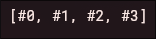

# PERTEMUAN 4

> Nama: Fahridana Ahmad Rayyansyah
>
> Kelas: TI-3B
>
> Absen: 10

<hr />

## Praktikum 1: Eksperimen Tipe Data List

### Langkah 1

Ketik atau salin kode program berikut ke dalam void main().

```Dart
  var list = [1, 2, 3];
  assert(list.length == 3);
  assert(list[1] == 2);
  print(list.length);
  print(list[1]);

  list[1] = 1;
  assert(list[1] == 1);
  print(list[1]);
```

### Langkah 2:

Silakan coba eksekusi (Run) kode pada langkah 1 tersebut. Apa yang terjadi? Jelaskan!

**Jawab**

> Kode tersebut akan memiliki output seperti ini:
>
> 
>
> kode tersebut memiliki output seperti diatas karena perintah `print(list.length)`, `print(list[1])`, dan `print(list[1])`. `print(list.length)` memiliki output 3 karena panjang dari list adalah 3, `print(list[1])` memiliki output 2 karena elemen dari list indeks 1 adalah 2, sedangkan `print(list[1])` memiliki output 1 karena terjadi perubahan value pada indeks 1 sehingga jika diprint lagi akan menghasilkan 1

### Langkah 3:

Ubah kode pada langkah 1 menjadi variabel final yang mempunyai index = 5 dengan default value = null. Isilah nama dan NIM Anda pada elemen index ke-1 dan ke-2. Lalu print dan capture hasilnya.

Apa yang terjadi ? Jika terjadi error, silakan perbaiki.

**Jawab**

> ```Dart
> void main() {
>   final list = List<String?>.filled(5, null);
>   print("Panjang List: " + list.length.toString());
>   list[1] = "Fahridana Ahmad Rayyansyah";
>   list[2] = "2241720158";
>   print("Indeks ke-0 List: " + list[0].toString()); // null
>   print("Indeks ke-1 List: " + list[1].toString());
>   print("Indeks ke-2 List: " + list[2].toString());
> }
> ```
>
> Output:
>
> `

## Praktikum 2: Eksperimen Tipe Data Set

### Langkah 1:

Ketik atau salin kode program berikut ke dalam fungsi main()

```dart
var halogens = {'fluorine', 'chlorine', 'bromine', 'iodine', 'astatine'};
print(halogens);
```

**Jawab**

> ```dart
> void main() {
>   var halogens = {'fluorine', 'chlorine', 'bromine', 'iodine', 'astatine'};
>   print(halogens);
> }
> ```

### Langkah 2:

Silakan coba eksekusi (Run) kode pada langkah 1 tersebut. Apa yang terjadi? Jelaskan! Lalu perbaiki jika terjadi error.

**Jawab**

> 
>
> Melakukan print pada Collection Set, tidak ada error

### Langkah 3:

Tambahkan kode program berikut, lalu coba eksekusi (Run) kode Anda.

```dart
  var names1 = <String>{};
  Set<String> names2 = {}; // This works, too.
  var names3 = {}; // Creates a map, not a set.

  print(names1);
  print(names2);
  print(names3);
```

Apa yang terjadi ? Jika terjadi error, silakan perbaiki namun tetap menggunakan ketiga variabel tersebut. Tambahkan elemen nama dan NIM Anda pada kedua variabel Set tersebut dengan dua fungsi berbeda yaitu .add() dan .addAll(). Untuk variabel Map dihapus, nanti kita coba di praktikum selanjutnya.

Dokumentasikan code dan hasil di console, lalu buat laporannya.

**Jawab**

> Tidak error, print akan menampilkan sebuah collection kosong
>
> 
>
> Beginilah kode setelah menambahkan fungsi .add() dan .addAll() serti menghapus variabel Map:
>
> ```dart
> void main() {
>   var names1 = <String>{};
>   Set<String> names2 = {};
>
>   names1.add("Fahridana Ahmad Rayyansyah");
>   names1.add("2241720158");
>
>   names2.addAll({"Fahridana Ahmad Rayyansyah", "2241720158"});
>
>   print(names1);
>   print(names2);
> }
> ```
>
> Output:
>
> 


## Praktikum 3: Eksperimen Tipe Data Maps

### Langkah 1:
Ketik atau salin kode program berikut ke dalam fungsi main().
```dart
var gifts = {
  // Key:    Value
  'first': 'partridge',
  'second': 'turtledoves',
  'fifth': 1
};

var nobleGases = {
  2: 'helium',
  10: 'neon',
  18: 2,
};

print(gifts);
print(nobleGases);
```

**Jawab**
> ```dart
> void main() {
>   var gifts = {
>     // Key:    Value
>     'first': 'partridge',
>     'second': 'turtledoves',
>     'fifth': 1
>   };
>
>   var nobleGases = {
>     2: 'helium',
>     10: 'neon',
>     18: 2,
>   };
>
>   print(gifts);
>   print(nobleGases);
> }
> ```

### Langkah 2:
Silakan coba eksekusi (Run) kode pada langkah 1 tersebut. Apa yang terjadi? Jelaskan! Lalu perbaiki jika terjadi error.

**Jawab**
> Tidak terjadi error, dan menampilkan key-value dari Collection Map
> Output:
>
> 

### Langkah 3:
Tambahkan kode program berikut, lalu coba eksekusi (Run) kode Anda.
```dart
var mhs1 = Map<String, String>();
gifts['first'] = 'partridge';
gifts['second'] = 'turtledoves';
gifts['fifth'] = 'golden rings';

var mhs2 = Map<int, String>();
nobleGases[2] = 'helium';
nobleGases[10] = 'neon';
nobleGases[18] = 'argon';
```
Apa yang terjadi ? Jika terjadi error, silakan perbaiki.

Tambahkan elemen nama dan NIM Anda pada tiap variabel di atas (gifts, nobleGases, mhs1, dan mhs2). Dokumentasikan hasilnya dan buat laporannya!

**Jawab**
> Tidak terjadi error dan output untuk kode diatas sama dengan langkah 2, karena tidak ada perubahan/penambahan fungsi `print()`
> Ini adalah kode setelah menambahkan elemen nama dan NIM pada variabel (gifts, nobleGases, mhs1, mhs2):
```dart
void main() {
  var gifts = {
    // Key:    Value
    'first': 'partridge',
    'second': 'turtledoves',
    'fifth': 1
  };

  var nobleGases = {
    2: 'helium',
    10: 'neon',
    18: 2,
  };

  var mhs1 = Map<String, String>();
  gifts['first'] = 'partridge';
  gifts['second'] = 'turtledoves';
  gifts['fifth'] = 'golden rings';

  var mhs2 = Map<int, String>();
  nobleGases[2] = 'helium';
  nobleGases[10] = 'neon';
  nobleGases[18] = 'argon';

  gifts['2241720158'] = 'Fahridana Ahmad Rayyansyah';
  nobleGases[2241720158] = "Fahridana Ahmad Rayyansyah";
  mhs1["2241720158"] = "Fahridana Ahmad Rayyansyah";
  mhs2[2241720158] = "Fahridana Ahmad Rayyansyah";

  print(gifts);
  print(nobleGases);
  print(mhs1);
  print(mhs2);
}
```
output:


## Praktikum 4: Eksperimen Tipe Data List: Spread dan Control-flow Operators

### Langkah 1:
Ketik atau salin kode program berikut ke dalam fungsi main().
```dart
var list = [1, 2, 3];
var list2 = [0, ...list];
print(list1);
print(list2);
print(list2.length);
```

**Jawab**
```dart
void main() {
  var list1 = [1, 2, 3];
  var list2 = [0, ...list1];
  print(list1);
  print(list2);
  print(list2.length);
}
```

### Langkah 2:
Silakan coba eksekusi (Run) kode pada langkah 1 tersebut. Apa yang terjadi? Jelaskan! Lalu perbaiki jika terjadi error.

**Jawab**
> Terjadi error karena variabel tidak sesuai yang awalnya diberi nama list, dipanggil list1, solusinya adalah mengganti nama tersebut, kode sudah diperbaiki dijawaban langkah 1. Inilah output dari kode tersebut:


### Langkah 3:
Tambahkan kode program berikut, lalu coba eksekusi (Run) kode Anda.
```dart
list1 = [1, 2, null];
print(list1);
var list3 = [0, ...?list1];
print(list3.length);
```
Apa yang terjadi ? Jika terjadi error, silakan perbaiki.

Tambahkan variabel list berisi NIM Anda menggunakan Spread Operators. Dokumentasikan hasilnya dan buat laporannya!

**Jawab**
> Terjadi error karena terdapat nilai null, error tersebut dikarenakan null-safety pada dart. Untuk memperbaikinya perlu secara eksplisit memperbolehkan variabel tersebut bernilai null, sehingga kode tersebut akan seperti ini
```dart
void main() {
  var list1 = <int?>[1, 2, 3];
  var list2 = [0, ...list1];
  print(list1);
  print(list2);
  print(list2.length);

  list1 = [1, 2, null];
  print(list1);
  var list3 = [0, ...list1];
  print(list3.length);
}
```
output:


> Menambahkan nama dan nim menggunakan spread operator:
```dart
void main() {
  var profile = ["2241720158", "Fahridana Ahmad Rayyansyah"];
  var ans = ["Nim dan Nama", ...profile];

  print(ans);
}
```
Output:


### Langkah 4:
Tambahkan kode program berikut, lalu coba eksekusi (Run) kode Anda.
```dart
var nav = ['Home', 'Furniture', 'Plants', if (promoActive) 'Outlet'];
print(nav);
```
Apa yang terjadi ? Jika terjadi error, silakan perbaiki. Tunjukkan hasilnya jika variabel `promoActive` ketika `true` dan `false`.

**Jawab**
> Akan terdapat error karena variabel `promoActive` belum dideklarasikan, beginilah kode setelah diperbaiki:
```dart
void main() {
  bool isPromoActive = true;
  var nav = ['Home', 'Furniture', 'Plants', if (isPromoActive) 'Outlet'];
  print(nav);
}
```
output:


### Langkah 5:
Tambahkan kode program berikut, lalu coba eksekusi (Run) kode Anda.
```dart
var nav2 = ['Home', 'Furniture', 'Plants', if (login case 'Manager') 'Inventory'];
print(nav2);
```
Apa yang terjadi ? Jika terjadi error, silakan perbaiki. Tunjukkan hasilnya jika variabel login mempunyai kondisi lain.

**Jawab**
> Akan Terjadi error karena variabel `login` tidak ada, beginilah kode setelah diperbaiki dan diberi kondisi pada login
```dart
void main() {
  String login = "Manager";
  var nav2 = ['Home', 'Furniture', 'Plants', if (login case 'Manager') 'Inventory'];
  print(nav2);

  login = "User";
  nav2 = ['Home', 'Furniture', 'Plants', if (login case 'Manager') 'Inventory'];
  print(nav2);
}
```
output:


### Langkah 6:
Tambahkan kode program berikut, lalu coba eksekusi (Run) kode Anda.
```dart
var listOfInts = [1, 2, 3];
var listOfStrings = ['#0', for (var i in listOfInts) '#$i'];
assert(listOfStrings[1] == '#1');
print(listOfStrings);
```
Apa yang terjadi ? Jika terjadi error, silakan perbaiki. Jelaskan manfaat Collection For dan dokumentasikan hasilnya.

**Jawab**
> Tidak terjadi error, Collection for berguna untuk menghasilkan data yang dinamis langsung di dalam Collection (list, map, set, dsb)
>
output:




